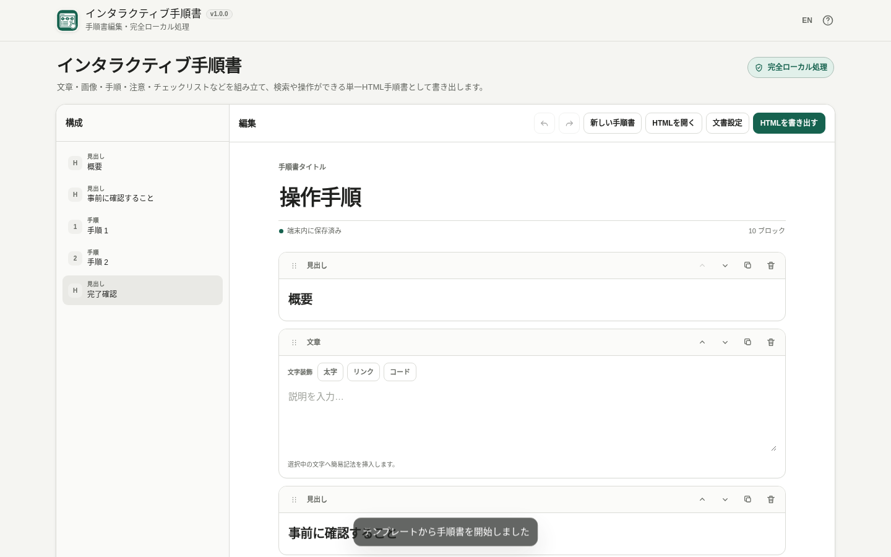

# Interactive Guide Maker

[](https://github.com/ttomohisa/htmlapps-interactive-guide-maker/actions/workflows/deploy-pages.yml)
[](LICENSE)
[](https://ttomohisa.github.io/htmlapps-interactive-guide-maker/)

[日本語版 README](README.ja.md)

Interactive Guide Maker is a Browser Kitty tool for building step-by-step guides from structured blocks directly in the browser. The finished v1.0 product will export a guide as one self-contained HTML file that can be handed to someone and opened in a normal browser.

**v1.0.0 is the first stable release.** On desktop, hover between blocks to reveal a compact `+` insertion control, and use the organized icon-based add-block area at the bottom for quick access. Drag image files over the editor to choose the insertion position, and reopen exported HTML later to continue editing.

## Live app

### [Open on GitHub Pages](https://ttomohisa.github.io/htmlapps-interactive-guide-maker/)

[](https://ttomohisa.github.io/htmlapps-interactive-guide-maker/)

## Features in v1.0.0

- Desktop hover insertion between blocks with an icon-only picker
- Position-aware image drag & drop with an insertion-line preview
- Exported Contents fix for duplicated Step/list numbering and clearer Heading/Step hierarchy


- Start screen for Blank guide / Open HTML / three task templates
- **How-to guide / Inspection checklist / Troubleshooting** templates
- Document settings for text size, content width, and Auto / Light / Dark theme
- Pre-export generated size plus an explicit warning at 25 MB or more
- Post-save completion state with generated filename and size
- Dedicated mobile **Structure / Edit / Preview** navigation and touch block sheet

- **Reopen an exported Interactive Guide Maker HTML and continue editing**
- Versioned embedded source data with `schemaVersion` and app signature
- Import validation for incompatible, damaged, or newer guide formats
- Imported HTML is parsed as data; its scripts are not executed
- Viewer and round-trip editor share the same embedded image asset payload to avoid duplicating image data
- **Export the finished guide as one self-contained HTML file**
- Pre-export block, image, and file-size summary
- Editable filename with the `.html` extension kept separate; an edited name is kept when reopening Export for the same guide during the editing session
- Dialog-safe Undo/Redo and Ctrl/Cmd+S; Preview and Save always use current guide content
- Viewer preview before saving
- Automatic contents from Headings and Steps
- Full-text search including content inside Tabs
- Interactive checklists, Details, and Tabs in the exported viewer
- Search reveals matching closed Details; guides with two or more Details offer Expand all details / Collapse all details in exported HTML and its separate-tab Preview. Disclosure state lasts only while that viewer is open.
- Code copy with Clipboard API plus a local fallback
- Image lightbox / zoom
- Auto / Light / Dark viewer theme switching
- Print CSS
- Exported viewer CSP with `connect-src 'none'`
- Paragraph and Heading blocks
- Image blocks for PNG / JPEG / WebP / GIF
- Image input by file selection, drag & drop, and clipboard paste
- Image alt text, caption, display width, alignment, filename, dimensions, and size
- Understandable errors for unsupported or corrupt images, plus a warning for large images
- Step blocks with automatic numbering
- Callout blocks: Note / Caution / Important
- Checklist blocks with item add, edit, reorder, and delete
- Link blocks with safe URL-scheme validation
- Divider blocks
- Details blocks with editable summary and body
- Tabs blocks with 2–5 tabs
- Multiple Paragraph / Callout / Checklist / Link / Code / Divider blocks inside each tab
- Code blocks with an optional language label and one-click copy
- Lightweight paragraph helpers for Bold / Link / Inline Code markup
- Structure panel that lists Headings and Steps for navigation
- Duplicate, delete, move, and drag blocks to reorder them
- Undo / Redo, including keyboard shortcuts
- Immediate delete with an Undo toast
- Confirm before replacing a non-empty guide with a new one
- Auto-save locally using IndexedDB with a localStorage fallback
- Recover existing v0.1.0 through v0.7.0 drafts after reopening
- Japanese / English UI in the same HTML
- Responsive layout from desktop to smartphone widths
- Fully local processing with no runtime CDN, API, analytics, or telemetry
- Readable and gzip self-extracting single-HTML app builds from the Browser Kitty template

## Current scope

v1.0.0 keeps the core **create → export → hand off → reopen → edit again** flow and adds faster between-block insertion, position-aware image drops, and cleaner exported navigation. The exported HTML is both the finished browser-readable guide and the file used to resume editing later; no separate project format is required. See [APP_SPEC.md](APP_SPEC.md).

## Usage

1. Start blank or choose How-to guide, Inspection checklist, or Troubleshooting.
2. Enter a guide title.
3. Add Paragraph, Image, Heading, Step, Callout, Checklist, Link, Details, Tabs, Code, or Divider blocks.
4. Add images with file selection, drag & drop, or clipboard paste.
5. Adjust image alt text, caption, display width, and alignment as needed.
6. Use Details for optional explanations, Tabs for platform-specific sections, and Code for commands/settings.
7. Fill in the remaining content. Step numbers update automatically when reordered.
8. Use Document settings for text size, content width, and initial reader theme.
9. Use Structure to jump between Headings and Steps.
10. Reorder blocks by dragging or using Move up / Move down.
11. Use Undo / Redo when needed; the current draft is saved locally.
12. Choose Export HTML and review block count, image count, file size, and filename.
13. Preview if needed, then Save HTML.
14. The export dialog shows the saved filename and generated size after the download starts.
15. Reopen the exported HTML later with Open HTML to continue editing.

Generic HTML files are not imported as editable guides. Clearing browser site data may remove the locally saved draft, but an exported Interactive Guide Maker HTML still contains its own editable source data.

## Privacy

Guide titles, block content, and imported images stay in the browser. The app does not upload user data and does not make runtime network connections. The default Content Security Policy keeps `connect-src 'none'`.

## Browser support

Primary targets:

- Current Chrome
- Current Edge

Also targeted where browser storage behavior allows:

- Firefox
- Safari
- Chrome on Android
- Safari on iOS

The generated normal standalone HTML is designed to open directly with `file://`.

## Development

The repository follows the Browser Kitty single-HTML template contract.

| File | Purpose |
| --- | --- |
| `AGENTS.md` | Implementation rules for coding agents |
| `APP_SPEC.md` | Product behavior, scope, and acceptance criteria |
| `app.config.json` | App metadata and standalone-build settings |
| `src/index.template.html` | Editable app source |
| `assets/favicon.svg` | Canonical favicon and upper-left app icon |
| `components/` | Reusable Browser Kitty UI components |

No third-party runtime dependency is required in v1.0.0.

## Build

With Node.js 24 or later installed, on Windows 10/11 run:

```bat
build-standalone.bat
```

After a build, `start-local.bat` opens `dist/index.html` directly in the default browser.

The template build validates PowerShell source first, checks the repository contract, generates the readable standalone HTML, and also creates the optional gzip self-extracting variant.

Generated artifacts include:

```text
dist/
├─ index.html
├─ index.self-extract.html
├─ dependency-manifest.json
├─ build-size-report.json
├─ self-extract-manifest.json
└─ .nojekyll
```

The normal build also refreshes `interactive-guide-maker.html` from the readable build. A custom `-OutputPath` leaves that root download unchanged. Repository checks run the same behavior suite against source, readable, self-extracting, and root HTML, then verify release parity.

Do not edit generated `dist/index*.html` or `interactive-guide-maker.html` manually. Edit the source and rebuild.

## Roadmap

- **v0.7.0:** dedicated mobile editing navigation
- **v0.8.0:** templates, start UX, and document settings
- **v1.0.0:** first stable release

## License

MIT License. See [LICENSE](LICENSE).
